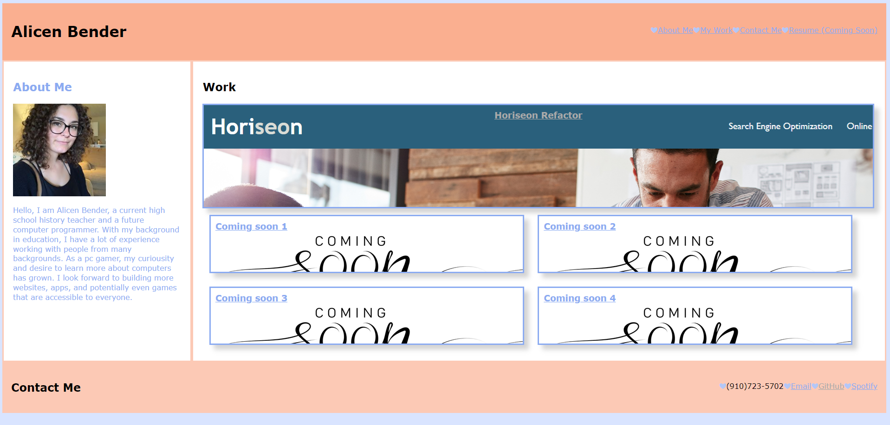

# coding-portfolio
Portfolio for my work.

## Description
This code is for my personal portfolio that will eventually display my othe projects. It will be updated as I make it through the coding bootcamp I am currently enrolled in. The goal was to keep all my websites, apps, and other projects in one location. In this location, I wanted it to be a simple design and aesthetic that could also show my growth. Getting the boxes under "Work" to line up how I wanted was very difficult, and I managed a fix that got me the desired results of one larger box on the top, and two columns with two elements each.

## Credits
I used W3 Schools and MDN Web Docs to create some of the styling on my website, including the link styling. 